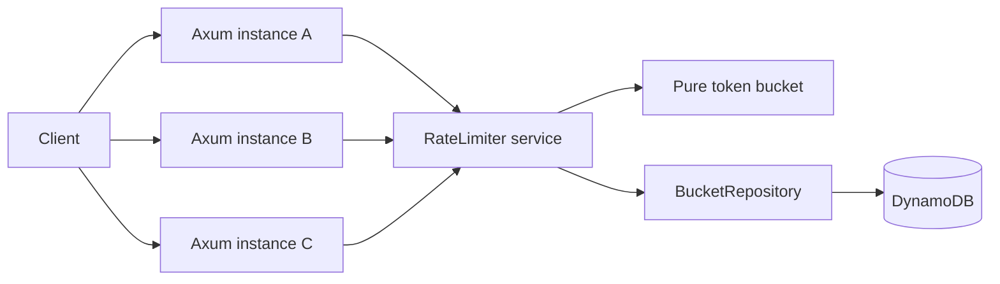

# FluxGate Architecture

## Request path

1. The API validates the JSON shape, policy name, key length, and cost.
2. `RateLimiter` strongly loads the bucket from `BucketRepository`.
3. The pure token-bucket function refills and consumes quota at an explicit epoch-millisecond timestamp.
4. The repository performs a conditional `PutItem`: create only if absent, or replace only if `version` still equals the loaded generation.
5. On a conflict, the service backs off, reloads, recomputes, and retries up to `MAX_CONFLICT_RETRIES`.
6. The API returns the decision and standard quota metadata. Storage failures and retry exhaustion fail closed with HTTP 503.

## The race condition

An unsafe read-modify-write lets instances A and B both read 10 tokens, both subtract one, and both write 9. Two requests were allowed while only one token was recorded as consumed—a lost update.

FluxGate's condition makes the version comparison and replacement one atomic DynamoDB operation. Only one writer can advance version 7 to version 8. Every loser receives a conditional-check failure and must recompute from the winner's state. Therefore each successful allowance corresponds to one committed token deduction.

## Retry behavior

Retries are bounded and use a small capped backoff. Bounds prevent a hot key from occupying a Tokio task indefinitely. Exhaustion returns service unavailable rather than allowing a request without durable quota consumption. This is a **fail-closed** design.

## Consistency and failure modes

- Reads are strongly consistent to reduce predictable stale-read conflicts.
- Conditional writes, not strong reads, provide the correctness guarantee.
- DynamoDB unavailability returns 503. FluxGate never silently switches to per-instance state.
- Server clocks are assumed to be NTP-synchronized. A timestamp older than the stored timestamp is rejected rather than minting incorrect quota.
- TTL removes inactive records eventually. Old records refill through timestamp math even when deletion is delayed.
- One extremely popular client key is inherently a hot DynamoDB item. Horizontal application scaling cannot remove that per-key serialization point.

## Scope decisions

- Token bucket permits controlled bursts and needs constant storage per key.
- One conditional item write is cheaper and simpler than a DynamoDB transaction because one decision touches one bucket.
- Policies are immutable application configuration. There is no administrative frontend.
- Prometheus, alternative algorithms, Redis caching, multi-region tables, and Kubernetes are outside the current scope.
