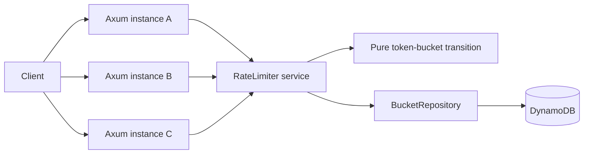

# FluxGate

FluxGate is a distributed token-bucket rate limiter written in Rust. Axum serves the HTTP API, DynamoDB stores shared bucket state, and conditional writes prevent concurrent application instances from granting more quota than a policy allows.

## Features

- Exact integer token-bucket arithmetic with configurable request costs
- Global limits shared across stateless service instances
- DynamoDB optimistic concurrency control with bounded retries
- Built-in policies and policy-specific endpoints
- DynamoDB TTL metadata for inactive-bucket cleanup
- Structured logs, request IDs, and rate-limit response headers
- Deterministic unit tests, DynamoDB integration tests, and k6 workloads

## Why distributed rate limiting matters

An in-memory limiter gives every server its own quota. Three servers could therefore grant three times the intended limit. FluxGate instead coordinates through a single DynamoDB item per policy and client, preserving one global limit across application instances.



## Concurrency invariant

The DynamoDB integration suite launches **200 concurrent checks** against a capacity-100 bucket and distributes them across **three independent `RateLimiter` instances and AWS SDK clients**. Against DynamoDB Local, exactly **100 are allowed and 100 are denied**. The final item has version 199 and zero available quota units, proving all 200 decisions are serialized without lost updates.

This is a correctness result, not a throughput benchmark. Performance numbers are intentionally absent until the k6 workloads are run in a documented environment.

## How it works

1. The API validates the policy, client key, and optional request cost.
2. The service strongly reads the bucket state.
3. A pure function refills and evaluates the token bucket at an explicit timestamp.
4. DynamoDB conditionally creates the item if absent or replaces it only if its version is unchanged.
5. A conflicting writer reloads, recomputes, and retries with a bounded backoff.
6. Exhausted retries or storage failures return HTTP 503; FluxGate never silently falls back to unsafe per-instance state.

See [ARCHITECTURE.md](ARCHITECTURE.md) for the full race-condition analysis and [docs/DYNAMODB.md](docs/DYNAMODB.md) for the storage design.

## API

Health check:

```bash
curl http://localhost:8080/health
```

```json
{"status":"ok"}
```

Consume one unit from the default policy:

```bash
curl -i -X POST http://localhost:8080/v1/check \
  -H 'Content-Type: application/json' \
  -d '{"key":"user_123"}'
```

Consume five units from a named policy:

```bash
curl -i -X POST http://localhost:8080/v1/check/expensive_api \
  -H 'Content-Type: application/json' \
  -d '{"key":"user_123","cost":5}'
```

```json
{
  "allowed": true,
  "limit": 20,
  "remaining": 15,
  "reset_after_ms": 75000
}
```

Every decision includes `X-RateLimit-Limit`, `X-RateLimit-Remaining`, `X-RateLimit-Reset-Ms`, and `X-Request-ID`. Denied decisions also include `Retry-After`. The decision endpoint returns 200 with `allowed=false`; an upstream application can map that result to HTTP 429.

Built-in policies:

| Name | Capacity | Refill |
| --- | ---: | --- |
| `default` | 100 | 100 per 60 seconds |
| `login` | 10 | 10 per 60 seconds |
| `expensive_api` | 20 | 20 per 300 seconds |

## Local development

FluxGate requires Rust 1.94 or newer for the current AWS SDK dependency set.

Start DynamoDB Local using its standalone distribution:

```bash
export DYNAMODB_LOCAL_HOME=/path/to/dynamodb-local
java -Djava.library.path="$DYNAMODB_LOCAL_HOME/DynamoDBLocal_lib" \
  -jar "$DYNAMODB_LOCAL_HOME/DynamoDBLocal.jar" \
  -sharedDb -inMemory -port 8000 -disableTelemetry
```

In another terminal:

```bash
DYNAMODB_ENDPOINT=http://localhost:8000 cargo run
```

The process creates the configured table and enables DynamoDB TTL automatically. For human-readable development logs, use `LOG_FORMAT=pretty cargo run`.

Alternatively, run the application and DynamoDB Local with Docker Compose:

```bash
docker compose up --build
```

## Configuration

| Variable | Default | Purpose |
| --- | --- | --- |
| `APP_HOST` | `0.0.0.0` | Server bind address |
| `APP_PORT` | `8080` | Server port |
| `AWS_REGION` | `us-east-1` | AWS SDK region |
| `DYNAMODB_ENDPOINT` | unset | Local endpoint override |
| `DYNAMODB_TABLE` | `fluxgate-rate-limits` | Shared state table |
| `BUCKET_TTL_SECONDS` | `86400` | Inactive-bucket cleanup horizon |
| `MAX_CONFLICT_RETRIES` | `32` | Bounded conditional-write retry budget |
| `RUST_LOG` | `fluxgate=info,tower_http=info` | Structured log filter |
| `LOG_FORMAT` | `json` | `json` or `pretty` output |

Local endpoint overrides use dummy credentials. A real AWS deployment uses the normal AWS SDK credential chain; no credentials are stored in the repository.

## DynamoDB data model

Each bucket is one item keyed as `RATE#<policy>#<SHA-256 client key>`. It stores `available_units`, `last_refill_ms`, `version`, and epoch-second `expires_at`. Static policy data is not duplicated in bucket items. The only access pattern is a point read or conditional point write, so scans and secondary indexes are unnecessary.

TTL is asynchronous cleanup only. Correctness always comes from application timestamp math and conditional writes, never from timely TTL deletion.

## Exact token-bucket arithmetic

FluxGate avoids floating-point drift with integer quota units:

- one token equals `refill_period_ms` quota units;
- each elapsed millisecond adds `refill_tokens` units;
- a request with cost `N` consumes `N * refill_period_ms` units.

The algorithm receives time explicitly, making partial refills exact and tests deterministic. See [docs/TOKEN_BUCKET.md](docs/TOKEN_BUCKET.md).

## Testing

Run the standard quality gates:

```bash
cargo fmt --check
cargo clippy --all-targets --all-features -- -D warnings
cargo test --all-targets --all-features
```

With DynamoDB Local listening on port 8000, run persistence, stale-writer, and hot-key tests:

```bash
cargo test --test dynamodb_repository -- --ignored --test-threads=1
```

The regular suite contains 24 deterministic unit and HTTP tests. The local DynamoDB suite contains three integration tests.

## Load testing

Four reproducible k6 profiles cover one key, 100 keys, 1,000 keys, and a highly contended hot key. Each reports request latency plus allowed, denied, and error counters.

```bash
RUN_ID=$(date +%s) SCENARIO=single_key k6 run load/k6.js
RUN_ID=$(date +%s) SCENARIO=hundred_keys k6 run load/k6.js
RUN_ID=$(date +%s) SCENARIO=thousand_keys k6 run load/k6.js
RUN_ID=$(date +%s) SCENARIO=hot_key k6 run load/k6.js
```

See [BENCHMARKS.md](BENCHMARKS.md) for workload details and result-recording guidelines.

## Dependency choices

- **Axum and Tokio:** typed HTTP routing on Rust's standard async ecosystem.
- **AWS SDK for Rust:** DynamoDB operations, local endpoint overrides, and the normal AWS credential chain.
- **Serde:** explicit JSON models.
- **tracing and tower-http:** structured events, HTTP spans, and propagated request IDs.
- **thiserror:** typed errors without panic-based production control flow.
- **async-trait:** a small mockable async persistence boundary.
- **SHA-256:** deterministic storage keys that do not expose client identifiers.

## Tradeoffs and future work

- One hot client key must serialize through one DynamoDB item; adding API servers cannot remove that per-key contention point.
- The service fails closed with 503 when durable coordination is unavailable. A fail-open mode could improve availability but would weaken quota guarantees.
- Policies are immutable application configuration to keep the MVP auditable.
- Prometheus metrics, infrastructure as code, and multi-region coordination are possible extensions.
